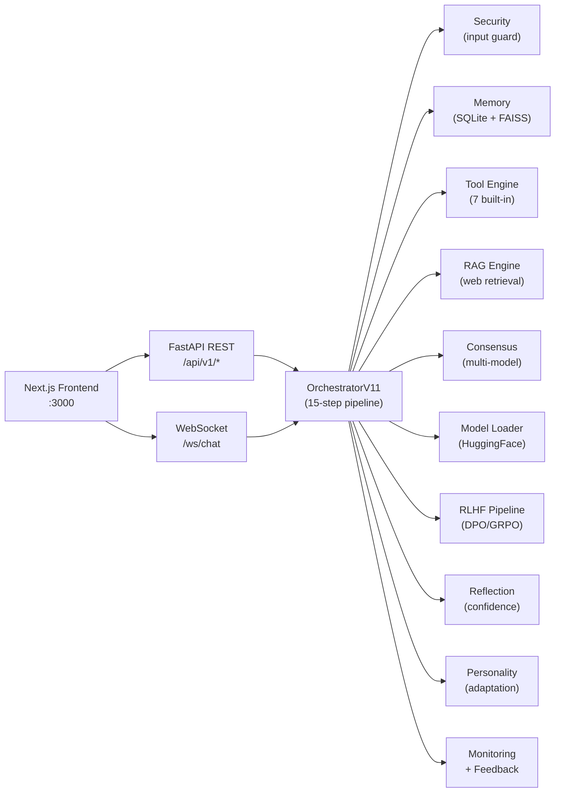

# SuperAI V11 — Comprehensive Project Report

> **Generated**: 2026-03-26 · **Scope**: Full codebase analysis covering architecture, features, workflow, and code

---

## 1. Executive Summary

SuperAI V11 is a **full-stack AI assistant platform** built with **FastAPI** (Python backend) and **Next.js** (TypeScript frontend). It integrates chat, tool calling, multi-layer memory, feedback capture, agent orchestration, voice I/O, document processing, retrieval-augmented generation, RLHF/consensus workflows, context engineering, and cognitive reasoning behind a single unified API and dashboard UI.

The project ships **25 backend subsystems**, **24 REST API route groups**, **41 built-in skill plugins**, **6 role-based bundles**, and a **Docker compose stack** with 6 services. The backend runs a **15-step orchestrator pipeline** per request, integrating security, memory, RAG, tools, consensus, reflection, personality, and RLHF scoring.

---

## 2. Technology Stack

### Backend
| Technology | Purpose |
|---|---|
| Python 3.11 | Core language |
| FastAPI | REST API + WebSocket framework |
| Uvicorn | ASGI server |
| Pydantic v2 | Schema validation + settings |
| aiosqlite | Async SQLite for memory, feedback, RLHF logs |
| Loguru | Structured logging |
| Prometheus client | Metrics export |

### Frontend
| Technology | Purpose |
|---|---|
| Next.js 14 | React framework (App Router) |
| React 18 | UI library |
| TypeScript | Type safety |
| Zustand | State management |
| SWR | Data fetching |
| Axios | HTTP client |
| Framer Motion | Animations |
| Tailwind CSS | Styling |

### Optional AI/ML Dependencies
| Library | Feature |
|---|---|
| Transformers + Accelerate | Model loading/inference |
| Sentence Transformers | Embedding models |
| FAISS | Vector similarity search |
| TRL (≥0.12) + PEFT | RLHF training (DPO/GRPO/LoRA) |
| OpenAI Whisper | Speech-to-text |
| gTTS | Text-to-speech |
| pdfplumber / python-docx | Document parsing |
| DuckDuckGo Search | Web retrieval tool |

---

## 3. System Architecture

### 3.1 High-Level Data Flow



### 3.2 Repository Layout

```
superai_v11_final/
├── backend/
│   ├── api/                    REST (24 route groups) + WebSocket
│   ├── app/                    App factory + DI container
│   ├── core/                   Orchestrator, logging, routing, security
│   ├── models/                 Schema layer + lazy model loader
│   ├── memory/                 Conversation memory + advanced memory
│   ├── services/               Voice, vision, monitoring, feedback, agents
│   ├── intelligence/           Reflection, learning, registry, self-improvement
│   ├── tools/                  Tool registry + executor + calling engine
│   ├── rlhf/                   Reward model + RLHF pipeline
│   ├── consensus/              Multi-model consensus engine
│   ├── agents/                 Agent coordinator + parallel executor
│   ├── knowledge/              RAG engine
│   ├── workflow/               Agentic workflow engine (5 phases)
│   ├── skills/                 41 skill plugins + 6 bundles
│   ├── code_review/            Code review engine
│   ├── debugging/              Systematic debugger (4 phases)
│   ├── context/                Context compression engine
│   ├── evaluation/             LLM-as-Judge evaluator
│   ├── cognitive/              BDI cognitive engine
│   ├── personality/            Personality + emotional adaptation
│   ├── security_ai/            AI security (anomaly + threat detection)
│   ├── multimodal/             Multimodal fusion engine
│   ├── distributed/            Async task queue
│   ├── config/                 Pydantic settings (274 lines, ~30 config classes)
│   └── main.py                 Entry point
├── frontend/
│   ├── src/app/                Next.js App Router (page, layout, globals.css)
│   ├── src/components/         Chat, Dashboard, Agents, Voice panels
│   └── src/lib/                API client, Zustand store, utilities
├── config/config.yaml          Central YAML configuration (233 lines)
├── docker/                     Docker Compose + Dockerfiles + nginx + Prometheus
├── requirements/               Dependency sets (base, colab, dev, prod)
├── scripts/                    Colab launcher + smoke tests
├── tests/                      Unit + integration tests (82 tests passing)
├── data/                       SQLite DBs, models, checkpoints, logs
├── .env.example                Environment template
└── pyproject.toml              Python project metadata
```

---

## 4. Application Lifecycle & Startup

### 4.1 Entry Point

[main.py](file:///b:/SuperAI/superai_v11_complete/superai_v11_final/backend/main.py) creates the FastAPI app via [create_app()](file:///b:/SuperAI/superai_v11_complete/superai_v11_final/backend/app/factory.py#41-74) and runs it with Uvicorn.

### 4.2 App Factory

[factory.py](file:///b:/SuperAI/superai_v11_complete/superai_v11_final/backend/app/factory.py) configures:
- **Lifespan**: calls `container.startup()` on boot, `container.shutdown()` on stop
- **CORS middleware**: configurable origins
- **Timing middleware**: injects `X-Process-Time-Ms` header
- **Exception handlers**: domain errors → structured JSON, unhandled → 500
- **Routers**: mounts API v1 router at `/api/v1` and WebSocket router at `/ws`
- **Health endpoint**: `GET /health` → `{status, version, name, platform}`

### 4.3 Dependency Injection Container

[dependencies.py](file:///b:/SuperAI/superai_v11_complete/superai_v11_final/backend/app/dependencies.py) — [ServiceContainer](file:///b:/SuperAI/superai_v11_complete/superai_v11_final/backend/app/dependencies.py#7-319) orchestrates the full boot sequence:

1. **Core services** (always loaded): ModelLoader, MemoryService, SecurityEngine, TaskRouter, AgentCoordinator, FeedbackService, VoiceService, VisionService, AgentService, MonitoringService
2. **V10 features** (F1–F11): Reflection, Learning, AdvancedMemory, ParallelAgents, RAG, SelfImprovement, ModelRegistry, AISecurity, MultimodalFusion, TaskQueue, Personality
3. **V11 features** (S1–S3): RLHF Pipeline, Tool Calling Engine, Consensus Engine
4. **V12 features** (S4–S6): Workflow Engine, Skill Registry, Code Review, Debugger, Context Compressor, LLM Judge, BDI Cognitive Engine
5. **Orchestrator**: [OrchestratorV11](file:///b:/SuperAI/superai_v11_complete/superai_v11_final/backend/core/orchestrator.py#30-382) wired with all loaded services

Each feature loader uses **[_try_load()](file:///b:/SuperAI/superai_v11_complete/superai_v11_final/backend/app/dependencies.py#110-116)** — errors are caught and logged as warnings so independent features degrade gracefully.

### 4.4 Configuration System

[settings.py](file:///b:/SuperAI/superai_v11_complete/superai_v11_final/backend/config/settings.py) — **~30 Pydantic settings classes** with cascading:

1. [config/config.yaml](file:///b:/SuperAI/superai_v11_complete/superai_v11_final/config/config.yaml) → loaded at import time
2. [.env](file:///b:/SuperAI/superai_v11_complete/superai_v11_final/.env) file → overrides via `pydantic-settings`
3. Environment variables → highest priority (e.g. `SERVER__PORT=8000`)

Runtime validator rejects weak `SECRET_KEY` values outside dev/test.

---

## 5. The 15-Step Orchestrator Pipeline

[orchestrator.py](file:///b:/SuperAI/superai_v11_complete/superai_v11_final/backend/core/orchestrator.py) — The `OrchestratorV11.chat()` method processes each request through:

| Step | Label | Description |
|------|-------|-------------|
| 1 | **AI Security** | Threat assessment → blocks if anomaly detected |
| 2 | **Correction Detection** | Checks if user is correcting a previous mistake |
| 3 | **Personality Emotion** | Detects user emotion, updates session state |
| 4 | **Task Routing** | Classifies prompt → `TaskType` (chat, code, math, search, etc.) |
| 5 | **Memory Retrieval** | Unified memory (episodic + semantic graph + base) |
| 6 | **RAG++ Retrieval** | Web-based knowledge lookup for search/chat/document tasks |
| 7 | **Tool Calling** | Selects + executes tools, injects results into prompt |
| 8 | **Prompt Assembly** | Builds full context: system prompt + personality + history + RAG + tools |
| 9 | **Model Selection** | Registry-based or routing-based model selection |
| 10 | **Consensus / Inference** | Multi-model voting OR direct inference (with task queue option) |
| 11 | **Self-Reflection** | Confidence scoring → critique loop if below threshold |
| 12 | **Low-Confidence Logging** | Records failures in self-improvement DB |
| 13 | **Personality Response** | Personalizes output style |
| 14 | **RLHF Reward Scoring** | Non-blocking reward score logged for training |
| 15 | **Persistence** | Saves turn to memory + episodic store |

The same pipeline also runs for [chat_stream()](file:///b:/SuperAI/superai_v11_complete/superai_v11_final/backend/core/orchestrator.py#210-299) with WebSocket token streaming.

---

## 6. Feature Inventory

### 6.1 Core Features (Always Active)

#### Chat (REST + WebSocket)
- `POST /api/v1/chat/` → synchronous chat with full pipeline
- `ws://localhost:8000/ws/chat` → token-level streaming
- Session history, per-response IDs, timing headers

#### Code Assistant
- Actions: `generate`, [debug](file:///b:/SuperAI/superai_v11_complete/superai_v11_final/backend/app/dependencies.py#311-313), [explain](file:///b:/SuperAI/superai_v11_complete/superai_v11_final/backend/cognitive/bdi_engine.py#297-333), [review](file:///b:/SuperAI/superai_v11_complete/superai_v11_final/backend/workflow/engine.py#137-159), [optimize](file:///b:/SuperAI/superai_v11_complete/superai_v11_final/backend/context/context_compressor.py#305-327), `test`
- `POST /api/v1/code/assistant` + `POST /api/v1/code/scan`

#### Agent Orchestration
- Autonomous/assisted agent runs with goal-based execution
- Shared context bus with configurable TTL
- `POST /api/v1/agents/run`

#### Voice I/O
- Speech-to-text via OpenAI Whisper
- Text-to-speech via gTTS
- Configurable sample rate, VAD threshold, language

#### Vision Analysis
- Image analysis endpoint at `POST /api/v1/vision/analyze`
- Falls back to OpenCV description if no vision model configured

#### File Processing
- Upload + Q&A: PDF (pdfplumber), DOCX (python-docx), TXT, PY, MD
- File content truncated at 3000 chars for context, 2000 for summary
- `POST /api/v1/files/upload` + `POST /api/v1/files/qa`

#### Feedback Collection
- Rating capture (1–5 stars) + optional comment
- SQLite persistence, rolling quality stats
- `POST /api/v1/feedback/`

#### System Monitoring
- `GET /api/v1/system/status` → feature list, metrics, health
- `GET /api/v1/system/metrics` → Prometheus-compatible
- Request latency, token counts, per-model tracking

---

### 6.2 Intelligence Layer (V10 Features F1–F11)

#### F1 — Self-Reflection Engine
[reflection_engine.py](file:///b:/SuperAI/superai_v11_complete/superai_v11_final/backend/intelligence/reflection_engine.py)

- **Confidence scoring** (0.0–1.0): length heuristic, hedging word detection (14 patterns), contradiction density, admission of ignorance
- **Critique loop**: if confidence < threshold (default 0.6), runs up to 2 rounds of "self-critic AI" prompts
- Each round: generates critique → extracts "IMPROVED ANSWER:" section → replaces answer
- Confidence boost: +0.15 per successful round, capped at 0.95

#### F2 — Continuous Learning Pipeline
[learning_pipeline.py](file:///b:/SuperAI/superai_v11_complete/superai_v11_final/backend/intelligence/learning_pipeline.py)

- **DatasetBuilder**: queries feedback DB for high-rated (≥4★) responses, cross-references conversation turns, saves as JSONL
- **LoRATrainer**: QLoRA fine-tuning with 4-bit quantization (nf4), batch_size=1, gradient_accumulation=8 — Colab T4 optimized
- **Background scheduler**: collects examples every N hours, emits `RETRAIN_READY` when threshold met
- Manual triggers: `POST /api/v1/learning/train`, `POST /api/v1/learning/collect`

#### F3 — Advanced Memory System
[advanced_memory.py](file:///b:/SuperAI/superai_v11_complete/superai_v11_final/backend/memory/advanced_memory.py)

- **Episodic Memory**: SQLite-backed, stores (session_id, prompt, response, importance, emotion)
- **Semantic Graph**: knowledge graph with entity-relationship extraction, serialized to pickle/JSON
- **Unified Memory Retriever**: merges base memory + episodic + semantic graph into enriched context
- **Emotional tagging**: detects emotions (positive, negative, curious, frustrated, neutral, urgent)

#### F4 — Parallel Multi-Agent Execution
[parallel_executor.py](file:///b:/SuperAI/superai_v11_complete/superai_v11_final/backend/agents/parallel_executor.py)

- 4 specializations: research, coding, reasoning, planning
- Configurable max concurrent agents (default: 4)
- Collaboration rounds with confidence-based conflict resolution
- `POST /api/v1/agents/parallel`

#### F5 — RAG++ (Retrieval-Augmented Generation)
[rag_engine.py](file:///b:/SuperAI/superai_v11_complete/superai_v11_final/backend/knowledge/rag_engine.py)

- Web retrieval via DuckDuckGo Search
- Chunk-based retrieval: chunk_size=400, overlap=80, top_k=5
- Cache with configurable TTL (default: 1 hour)

#### F6 — Self-Improvement Engine
[self_improvement.py](file:///b:/SuperAI/superai_v11_complete/superai_v11_final/backend/intelligence/self_improvement.py)

- **FailureDetector**: detects low ratings (≤2★), low confidence, user corrections, timeouts
- **FailureAnalyzer**: LLM-based root cause analysis with structured output
- **ImprovementLogger**: SQLite persistence with pattern analysis (7-day sliding window)
- **Background analysis loop**: runs every 12 hours, generates improvement suggestions
- Correction detection patterns: "no, that's wrong", "that's incorrect", "you're wrong", "actually,", etc.

#### F7 — Model Registry
[model_registry.py](file:///b:/SuperAI/superai_v11_complete/superai_v11_final/backend/intelligence/model_registry.py)

- Register models: HuggingFace Hub, local paths, LoRA adapters
- **Benchmarking**: runs 3 standard prompts, measures quality × latency → overall score
- **Auto-selection**: [best_for_task()](file:///b:/SuperAI/superai_v11_complete/superai_v11_final/backend/intelligence/model_registry.py#148-162) returns highest-scored model for a task type
- Hot-swap without server restart, JSON persistence at [data/model_registry.json](file:///b:/SuperAI/superai_v11_complete/superai_v11_final/data/model_registry.json)

#### F8 — AI Security Engine
[ai_security.py](file:///b:/SuperAI/superai_v11_complete/superai_v11_final/backend/security_ai/ai_security.py)

- Anomaly detection on input prompts
- Embedding-based threat model with similarity threshold (0.82)
- Blocks requests above threat threshold
- Security logs persisted to `data/security_logs/`

#### F9 — Multimodal Fusion
[fusion_engine.py](file:///b:/SuperAI/superai_v11_complete/superai_v11_final/backend/multimodal/fusion_engine.py)

- Sequential fusion strategy combining text (0.6), image (0.25), audio (0.15) weights
- Integrates vision + voice services into a unified analysis

#### F10 — Async Task Queue
[task_queue.py](file:///b:/SuperAI/superai_v11_complete/superai_v11_final/backend/distributed/task_queue.py)

- Async task abstraction for inference offloading
- Configurable max workers (4), task retention (1 hour)
- Submit/wait pattern with named tasks and priority levels

#### F11 — Personality Adaptation Engine
[personality_engine.py](file:///b:/SuperAI/superai_v11_complete/superai_v11_final/backend/personality/personality_engine.py)

- 5 personality traits: curiosity (0.8), empathy (0.7), directness (0.6), creativity (0.75), caution (0.5)
- Emotional intelligence: adapts tone based on detected user emotion
- Per-session state with configurable TTL (1 hour)
- System prompt addons based on active personality profile

---

### 6.3 V11 Features (S1–S3)

#### S1 — RLHF Pipeline (DPO + GRPO)
[rlhf_pipeline.py](file:///b:/SuperAI/superai_v11_complete/superai_v11_final/backend/rlhf/rlhf_pipeline.py)

**Training methods:**
- **DPO (Direct Preference Optimization)**: trains on (prompt, chosen, rejected) triples using LoRA r=8, batch=1, grad_accum=8, 4-bit quantization
- **GRPO (Group Relative Policy Optimization)**: generates groups of responses, scores with heuristic reward, no critic network needed

**Data pipeline:**
- [FeedbackToRLHFConverter](file:///b:/SuperAI/superai_v11_complete/superai_v11_final/backend/rlhf/rlhf_pipeline.py#44-124): pairs high-rated (≥4★) vs low-rated (≤2★) feedback responses
- Bootstrap fallback: creates truncated-response pairs if insufficient natural pairs
- Minimum pair threshold configurable (default: 10)

**Reward model:**
- Heuristic + neural reward scoring
- Non-blocking score on every chat response (logged for later training)

**API:**
- `POST /api/v1/rlhf/dpo` — trigger DPO training
- `POST /api/v1/rlhf/grpo` — trigger GRPO training  
- `POST /api/v1/rlhf/reward-train` — train the reward model
- `GET /api/v1/rlhf/status` — training run history

#### S2 — Tool Calling Engine
[tool_calling_engine.py](file:///b:/SuperAI/superai_v11_complete/superai_v11_final/backend/tools/tool_calling_engine.py) + [tool_executor.py](file:///b:/SuperAI/superai_v11_complete/superai_v11_final/backend/tools/tool_executor.py)

**Pipeline**: prompt → tool selection → argument extraction → parallel execution → enriched prompt

**7 Built-in Tools:**

| Tool | Category | Safety | Timeout |
|------|----------|--------|---------|
| [web_search](file:///b:/SuperAI/superai_v11_complete/superai_v11_final/backend/tools/tool_executor.py#90-100) | search | safe | 15s |
| [calculator](file:///b:/SuperAI/superai_v11_complete/superai_v11_final/backend/tools/tool_executor.py#102-117) | math | safe | 5s |
| [code_execute](file:///b:/SuperAI/superai_v11_complete/superai_v11_final/backend/tools/tool_executor.py#119-133) | code | **unsafe** | 12s |
| [wikipedia](file:///b:/SuperAI/superai_v11_complete/superai_v11_final/backend/tools/tool_executor.py#135-149) | search | safe | 12s |
| [weather](file:///b:/SuperAI/superai_v11_complete/superai_v11_final/backend/tools/tool_executor.py#151-161) | general | safe | 10s |
| [file_read](file:///b:/SuperAI/superai_v11_complete/superai_v11_final/backend/tools/tool_executor.py#163-174) | file | safe | 5s |
| [datetime](file:///b:/SuperAI/superai_v11_complete/superai_v11_final/backend/tools/tool_executor.py#176-179) | general | safe | 2s |

**Security for [code_execute](file:///b:/SuperAI/superai_v11_complete/superai_v11_final/backend/tools/tool_executor.py#119-133):**
- AST-level validation before execution
- Blocked modules: [os](file:///b:/SuperAI/superai_v11_complete/superai_v11_final/backend/intelligence/self_improvement.py#284-288), `sys`, `subprocess`, `socket`, `requests`, `importlib`, `pathlib`
- Blocked calls: `__import__`, `open`, [exec](file:///b:/SuperAI/superai_v11_complete/superai_v11_final/backend/workflow/engine.py#113-136), [eval](file:///b:/SuperAI/superai_v11_complete/superai_v11_final/backend/consensus/consensus_engine.py#65-77), `compile`, `input`
- Subprocess sandbox with 10-second timeout

**Autonomy levels**: unsafe tools blocked below autonomy level 3.

#### S3 — Multi-Model Consensus Engine
[consensus_engine.py](file:///b:/SuperAI/superai_v11_complete/superai_v11_final/backend/consensus/consensus_engine.py)

**Voting strategies:**

| Strategy | Method |
|----------|--------|
| `BEST` | Highest quality-scored response wins |
| `MAJORITY` | Response most similar to all others (max avg word-overlap) |
| `ENSEMBLE` | Meta-model synthesizes responses |
| `AUTO` | Auto-selects based on agreement level |

**Components:**
- [MultiModelRunner](file:///b:/SuperAI/superai_v11_complete/superai_v11_final/backend/consensus/consensus_engine.py#84-107): parallel `asyncio.gather` across all configured models
- [ResponseEvaluator](file:///b:/SuperAI/superai_v11_complete/superai_v11_final/backend/consensus/consensus_engine.py#61-82): heuristic quality scoring (length, hedging penalty, quality indicators, latency bonus)
- [ConflictDetector](file:///b:/SuperAI/superai_v11_complete/superai_v11_final/backend/consensus/consensus_engine.py#142-153): detects disagreement below configurable threshold (0.30)
- [MetaEvaluator](file:///b:/SuperAI/superai_v11_complete/superai_v11_final/backend/consensus/consensus_engine.py#155-182): LLM judge picks best answer when conflict detected

---

### 6.4 V12 Features (S4–S6)

#### S4 — Agentic Workflow Engine
[engine.py](file:///b:/SuperAI/superai_v11_complete/superai_v11_final/backend/workflow/engine.py)

**5-phase lifecycle**: `CREATED → BRAINSTORM → PLAN → EXECUTE → REVIEW → COMPLETE`

| Phase | Description |
|-------|-------------|
| **Brainstorm** | Generates clarifying questions, refines design with user answers |
| **Plan** | Creates structured task list with dependencies, target files, estimation |
| **Execute** | Runs tasks in batches (default: 3), tracks success/failure |
| **Review** | Final quality review with pass/fail scoring |
| **Complete** | Workflow finalized with review summary |

**API:**
- `POST /api/v1/workflow/create` → new workflow  
- `POST /api/v1/workflow/{id}/brainstorm` → generate/refine design  
- `POST /api/v1/workflow/{id}/plan` → create task plan  
- `POST /api/v1/workflow/{id}/execute` → run next batch  
- `POST /api/v1/workflow/{id}/review` → final review  
- `GET /api/v1/workflow/list` → all active workflows

#### S5 — Skills / Plugin System
[skill_registry.py](file:///b:/SuperAI/superai_v11_complete/superai_v11_final/backend/skills/skill_registry.py)

**41 built-in skill plugins** across diverse domains:

````carousel
**AI/ML Skills:**
- `rag-engineer` — RAG pipeline design
- `prompt-engineer` — prompt engineering
- `langgraph` — LangGraph patterns
- `multi-agent-patterns` — multi-agent design
- `memory-systems` — memory architecture
- `bdi-mental-states` — BDI cognitive patterns
- `hosted-agents` — hosted agent deployment
<!-- slide -->
**Context Engineering Skills:**
- `context-fundamentals` — context basics
- `context-compression` — compression techniques
- `context-degradation` — degradation detection
- `context-optimization` — KV-cache, masking
- `evaluation` — LLM evaluation
- `advanced-evaluation` — advanced evaluation rubrics
<!-- slide -->
**Development Skills:**
- `python-patterns` — Python best practices
- `typescript-expert` — TypeScript patterns
- `react-patterns` — React component patterns
- `frontend-design` — UI/UX design
- `api-design-principles` — REST API design
- `architecture` — system architecture
- `testing-patterns` — test patterns
- `tdd` — test-driven development
- `test-fixing` — fixing broken tests
<!-- slide -->
**DevOps & Deployment:**
- `docker-expert` — containerization
- `aws-serverless` — AWS Lambda/serverless
- `vercel-deployment` — Vercel deployment
- `workflow-automation` — CI/CD automation
- `create-pr` — pull request workflow
<!-- slide -->
**Security & Quality:**
- `security-auditor` — security auditing
- `vulnerability-scanner` — vulnerability scanning
- `api-security` — API security
- `code-review` — code review
- `lint-and-validate` — linting
<!-- slide -->
**Planning & Process:**
- `brainstorming` — ideation
- `writing-plans` — implementation plans
- `debugging` — general debugging
- `debugging-strategies` — systematic debugging
- `doc-coauthoring` — documentation
- `filesystem-context` — filesystem awareness
- `project-development` — project management
- `senior-architect` — architecture review
- `tool-design` — tool design patterns
````

**6 Role-Based Bundles:**

| Bundle | Icon | Skills Count | Focus |
|--------|------|------|-------|
| `web-dev` | 🌐 | 8 | Frontend, API, testing, deployment |
| [security](file:///b:/SuperAI/superai_v11_complete/superai_v11_final/backend/app/dependencies.py#289-291) | 🔒 | 5 | OWASP, vulnerability, API security |
| `ai-builder` | 🤖 | 8 | RAG, prompts, multi-agent, context |
| `full-stack` | 🚀 | 11 | Planning through deployment |
| `devops` | ⚙️ | 5 | Docker, AWS, Vercel, CI/CD |
| `context-engineer` | 🧠 | 8 | Context optimization, evaluation |

**Auto-activation**: Skills matched by trigger keywords in user prompt. Active bundle skills get enrichment priority.

#### S5b — Code Review Engine
[code_review.py](file:///b:/SuperAI/superai_v11_complete/superai_v11_final/backend/code_review/code_review.py)

- Severity levels: critical, warning, info
- Max 20 issues per review
- LLM-powered analysis with fallback heuristics

#### S5c — Systematic Debugger
[debugger.py](file:///b:/SuperAI/superai_v11_complete/superai_v11_final/backend/debugging/debugger.py)

**4-phase root cause analysis:**

| Phase | Goal |
|-------|------|
| **Reproduce** | Identify reproduction steps, expected vs actual behavior |
| **Isolate** | Narrow to root cause, rule out alternatives |
| **Fix** | Generate minimal targeted fix with risk assessment |
| **Verify** | Propose test cases, regression checks, edge cases |

Each phase runs an LLM prompt with structured output parsing. Falls back to heuristic suggestions when no model is available.

#### S6a — Context Compression Engine
[context_compressor.py](file:///b:/SuperAI/superai_v11_complete/superai_v11_final/backend/context/context_compressor.py)

**3-phase compression workflow:**
1. **Categorize**: segments → critical / supporting / noise (by priority threshold)
2. **Compress**: 4 methods auto-selected by target ratio:
   - [selective_omission](file:///b:/SuperAI/superai_v11_complete/superai_v11_final/backend/context/context_compressor.py#152-167) (>70% target) — remove noise tokens, ~0% loss
   - [structured_summary](file:///b:/SuperAI/superai_v11_complete/superai_v11_final/backend/context/context_compressor.py#168-185) (30-70%) — LLM-generated summary, ~5% loss
   - [extractive](file:///b:/SuperAI/superai_v11_complete/superai_v11_final/backend/context/context_compressor.py#186-202) (keyword-scored sentence selection)
   - [abstractive](file:///b:/SuperAI/superai_v11_complete/superai_v11_final/backend/context/context_compressor.py#203-215) (<30%) — model-generated, ~15% loss  
3. **Validate**: 6-dimension quality scoring → faithfulness, completeness, relevance, coherence, conciseness, actionability

**Degradation detection patterns:**
- `near_capacity` — context >90% of token budget
- `high_utilization` — above 70% compaction threshold
- `repetition_detected` — possible context poisoning
- `error_accumulation` — high error density
- `task_mixing` — multiple conflicting task markers

**Placement optimization**: U-shaped attention curve — critical at start/end, supporting in middle.

#### S6b — LLM-as-Judge Evaluator
[llm_judge.py](file:///b:/SuperAI/superai_v11_complete/superai_v11_final/backend/evaluation/llm_judge.py)

**Evaluation modes:**
- **Rubric scoring**: multi-criteria weighted evaluation (accuracy, completeness, relevance, clarity, safety)
- **Code evaluation**: specialized criteria (correctness, style, efficiency, security, maintainability)
- **Pairwise comparison**: head-to-head A vs B with winner + reason

Heuristic fallback when no model available.

#### S6c — BDI Cognitive Engine
[bdi_engine.py](file:///b:/SuperAI/superai_v11_complete/superai_v11_final/backend/cognitive/bdi_engine.py)

**Belief-Desire-Intention mental state tracking:**

| Component | Methods | Capacity |
|-----------|---------|----------|
| **Beliefs** | [add_belief](file:///b:/SuperAI/superai_v11_complete/superai_v11_final/backend/cognitive/bdi_engine.py#134-151), [revise_belief](file:///b:/SuperAI/superai_v11_complete/superai_v11_final/backend/cognitive/bdi_engine.py#152-165), [perceive](file:///b:/SuperAI/superai_v11_complete/superai_v11_final/backend/cognitive/bdi_engine.py#232-250) (LLM) | Max 100 |
| **Desires** | [add_desire](file:///b:/SuperAI/superai_v11_complete/superai_v11_final/backend/cognitive/bdi_engine.py#173-184), [fulfill_desire](file:///b:/SuperAI/superai_v11_complete/superai_v11_final/backend/cognitive/bdi_engine.py#185-191), [deliberate](file:///b:/SuperAI/superai_v11_complete/superai_v11_final/backend/cognitive/bdi_engine.py#251-268) (LLM) | Max 50 |
| **Intentions** | [commit_intention](file:///b:/SuperAI/superai_v11_complete/superai_v11_final/backend/cognitive/bdi_engine.py#199-213), [complete_intention](file:///b:/SuperAI/superai_v11_complete/superai_v11_final/backend/cognitive/bdi_engine.py#214-222), [abandon_intention](file:///b:/SuperAI/superai_v11_complete/superai_v11_final/backend/cognitive/bdi_engine.py#223-229), [plan_for](file:///b:/SuperAI/superai_v11_complete/superai_v11_final/backend/cognitive/bdi_engine.py#269-294) (LLM) | Max 20 |

**Cognitive cycle**: Perceive (extract beliefs from context) → Deliberate (generate goals from beliefs + request) → Plan (create action steps for intention)

**Backward tracing**: [explain_intention()](file:///b:/SuperAI/superai_v11_complete/superai_v11_final/backend/cognitive/bdi_engine.py#297-333) traces: Beliefs → Desire → Intention → Plan Steps

---

## 7. API Route Map

24 REST route groups mounted at `/api/v1`:

| Prefix | Tag | Module |
|--------|-----|--------|
| `/chat` | Chat | [chat.py](file:///b:/SuperAI/superai_v11_complete/superai_v11_final/backend/api/v1/chat.py) |
| `/agents` | Agents | [agents.py](file:///b:/SuperAI/superai_v11_complete/superai_v11_final/backend/api/v1/agents.py) |
| `/memory` | Memory | [memory.py](file:///b:/SuperAI/superai_v11_complete/superai_v11_final/backend/api/v1/memory.py) |
| `/voice` | Voice | [voice.py](file:///b:/SuperAI/superai_v11_complete/superai_v11_final/backend/api/v1/voice.py) |
| `/vision` | Vision | [vision.py](file:///b:/SuperAI/superai_v11_complete/superai_v11_final/backend/api/v1/vision.py) |
| `/files` | Files | [files.py](file:///b:/SuperAI/superai_v11_complete/superai_v11_final/backend/api/v1/files.py) |
| `/code` | Code | [code.py](file:///b:/SuperAI/superai_v11_complete/superai_v11_final/backend/api/v1/code.py) |
| `/system` | System | [system.py](file:///b:/SuperAI/superai_v11_complete/superai_v11_final/backend/api/v1/system.py) |
| `/feedback` | Feedback | [feedback.py](file:///b:/SuperAI/superai_v11_complete/superai_v11_final/backend/api/v1/feedback.py) |
| `/intelligence` | Intelligence | [intelligence.py](file:///b:/SuperAI/superai_v11_complete/superai_v11_final/backend/api/v1/intelligence.py) |
| `/knowledge` | Knowledge | [knowledge.py](file:///b:/SuperAI/superai_v11_complete/superai_v11_final/backend/api/v1/knowledge.py) |
| `/learning` | Learning | [learning.py](file:///b:/SuperAI/superai_v11_complete/superai_v11_final/backend/api/v1/learning.py) |
| `/security` | Security | [security_info.py](file:///b:/SuperAI/superai_v11_complete/superai_v11_final/backend/api/v1/security_info.py) |
| `/personality` | Personality | [personality_api.py](file:///b:/SuperAI/superai_v11_complete/superai_v11_final/backend/api/v1/personality_api.py) |
| `/rlhf` | RLHF V11 | [rlhf_api.py](file:///b:/SuperAI/superai_v11_complete/superai_v11_final/backend/api/v1/rlhf_api.py) |
| `/tools` | Tools V11 | [tools_api.py](file:///b:/SuperAI/superai_v11_complete/superai_v11_final/backend/api/v1/tools_api.py) |
| `/consensus` | Consensus V11 | [consensus_api.py](file:///b:/SuperAI/superai_v11_complete/superai_v11_final/backend/api/v1/consensus_api.py) |
| `/workflow` | Workflow V12 | [workflow_api.py](file:///b:/SuperAI/superai_v11_complete/superai_v11_final/backend/api/v1/workflow_api.py) |
| `/skills` | Skills V12 | [skills_api.py](file:///b:/SuperAI/superai_v11_complete/superai_v11_final/backend/api/v1/skills_api.py) |
| `/code-review` | Code Review V12 | [code_review_api.py](file:///b:/SuperAI/superai_v11_complete/superai_v11_final/backend/api/v1/code_review_api.py) |
| `/debug` | Debug V12 | [debug_api.py](file:///b:/SuperAI/superai_v11_complete/superai_v11_final/backend/api/v1/debug_api.py) |
| `/context` | Context V12 | [context_api.py](file:///b:/SuperAI/superai_v11_complete/superai_v11_final/backend/api/v1/context_api.py) |
| `/evaluation` | Evaluation V12 | [evaluation_api.py](file:///b:/SuperAI/superai_v11_complete/superai_v11_final/backend/api/v1/evaluation_api.py) |
| `/cognitive` | Cognitive V12 | [cognitive_api.py](file:///b:/SuperAI/superai_v11_complete/superai_v11_final/backend/api/v1/cognitive_api.py) |

Plus: `GET /health`, `GET /docs`, `GET /redoc`, `ws://*/ws/chat`

---

## 8. Frontend Architecture

### 8.1 Framework
- **Next.js 14** with App Router (`src/app/`)
- **TypeScript** throughout
- **Tailwind CSS** for styling

### 8.2 Panel Structure

| Panel | Component | Function |
|-------|-----------|----------|
| Chat | `ChatPanel.tsx` | Message I/O, streaming, history |
| Dashboard | `Dashboard.tsx` | System status, metrics, health |
| Agents | `AgentPanel.tsx` | Agent runs, parallel execution |
| Voice | `VoiceUI.tsx` | STT/TTS recording, playback |

### 8.3 State Management
- **Zustand** store ([src/lib/store.ts](file:///b:/SuperAI/superai_v11_complete/superai_v11_final/frontend/src/lib/store.ts)) — chat state, settings, active panel
- **SWR** for data fetching with revalidation
- **Axios** API client ([src/lib/api.ts](file:///b:/SuperAI/superai_v11_complete/superai_v11_final/frontend/src/lib/api.ts)) — typed endpoints

---

## 9. Deployment Infrastructure

### 9.1 Docker Compose Stack

[docker-compose.yml](file:///b:/SuperAI/superai_v11_complete/superai_v11_final/docker/docker-compose.yml) — **6 services:**

| Service | Image | Port | Notes |
|---------|-------|------|-------|
| [backend](file:///b:/SuperAI/superai_v11_complete/superai_v11_final/docker/Dockerfile.backend) | Custom (Dockerfile.backend) | 8000 | Health check, GPU support, env injection |
| [frontend](file:///b:/SuperAI/superai_v11_complete/superai_v11_final/docker/Dockerfile.frontend) | Custom (Dockerfile.frontend) | 3000 | Depends on backend health |
| `redis` | redis:7-alpine | 6379 | AOF persistence, 512MB memory limit, LRU eviction |
| `prometheus` | prom/prometheus | 9090 | Metrics scraping |
| `grafana` | grafana/grafana | 3001 | Dashboards, depends on Prometheus |
| `nginx` | nginx:alpine | 80 | Reverse proxy for backend + frontend |

**Named volumes**: `v12_data`, `v12_logs`, `redis_data`, `prometheus_data`, `grafana_data`, `hf_cache`

### 9.2 Colab Deployment
- [run_colab_v11.py](file:///b:/SuperAI/superai_v11_complete/superai_v11_final/scripts/run_colab_v11.py): installs deps, patches config for `/content`, starts backend, opens ngrok tunnel
- [SuperAI_V11_Colab.ipynb](file:///b:/SuperAI/superai_v11_complete/superai_v11_final/SuperAI_V11_Colab.ipynb): interactive notebook

---

## 10. Data Layer

### 10.1 SQLite Databases

| Database | Path | Purpose |
|----------|------|---------|
| [superai_v11.db](file:///b:/SuperAI/superai_v11_complete/superai_v11_final/data/superai_v11.db) | `data/` | Conversation turns (session_id, user_msg, assistant_msg, timestamp) |
| [feedback.db](file:///b:/SuperAI/superai_v11_complete/superai_v11_final/data/feedback.db) | `data/` | User ratings (response_id, score, comment) |
| [episodic.db](file:///b:/SuperAI/superai_v11_complete/superai_v11_final/data/episodic.db) | `data/` | Episodic memory (session, prompt, response, importance, emotion) |
| [improvements.db](file:///b:/SuperAI/superai_v11_complete/superai_v11_final/data/improvements.db) | `data/` | Failure records + improvement logs |
| [rlhf_logs.db](file:///b:/SuperAI/superai_v11_complete/superai_v11_final/data/rlhf_logs.db) | `data/` | RLHF training run history |

### 10.2 File-Based Storage

| Path | Content |
|------|---------|
| [data/model_registry.json](file:///b:/SuperAI/superai_v11_complete/superai_v11_final/data/model_registry.json) | Registered model metadata + benchmark scores |
| [data/knowledge_graph.pkl](file:///b:/SuperAI/superai_v11_complete/superai_v11_final/data/knowledge_graph.pkl) | Semantic graph (pickle) |
| `data/training/` | JSONL training datasets from learning pipeline |
| `data/lora_checkpoints/` | LoRA fine-tuning checkpoints |
| `data/rlhf_checkpoints/` | DPO/GRPO training checkpoints |
| `data/improvement_logs/` | Structured failure log files |
| `data/security_logs/` | AI security anomaly logs |

---

## 11. Security Architecture

### Multi-Layer Security

| Layer | Component | Protection |
|-------|-----------|------------|
| **Input** | `SecurityEngine` | Prompt injection guard, input validation |
| **AI** | `AISecurityEngine` | Anomaly detection, embedding threat model, auto-block |
| **Code** | Tool sandboxing | AST validation, blocked imports/calls, subprocess timeout |
| **Output** | Output filter | Post-generation content filtering |
| **Auth** | Secret key | MODEL_VALIDATOR rejects weak keys in production |
| **File** | Path traversal guard | [file_read](file:///b:/SuperAI/superai_v11_complete/superai_v11_final/backend/tools/tool_executor.py#163-174) restricted to `data/uploads/` |
| **Rate** | Rate limiter | 60 requests/minute per configuration |

---

## 12. Testing & Verification

### Test Infrastructure
- **82 tests passing** (`python -m pytest -q`)
- **Unit tests**: `tests/unit/` — isolated component tests
- **Integration tests**: `tests/integration/` — service interaction tests
- **Frontend type-check**: `npm run type-check` ✓
- **Frontend build**: `npm run build` ✓
- **Smoke tests**: [scripts/smoke_test_v11.py](file:///b:/SuperAI/superai_v11_complete/superai_v11_final/scripts/smoke_test_v11.py) (23KB comprehensive test suite)

---

## 13. Configuration Reference

All settings live in [config.yaml](file:///b:/SuperAI/superai_v11_complete/superai_v11_final/config/config.yaml) with env var overrides:

| Section | Key Settings | Default |
|---------|-------------|---------|
| `server` | host, port, reload, workers, cors_origins | 0.0.0.0:8000, 1 worker |
| [models](file:///b:/SuperAI/superai_v11_complete/superai_v11_final/backend/intelligence/model_registry.py#81-86) | device, cache_size, routing (6 task types) | auto, TinyLlama |
| [memory](file:///b:/SuperAI/superai_v11_complete/superai_v11_final/backend/app/dependencies.py#264-266) | backend, db_path, vector_store, embedding_model | sqlite, FAISS, bge-small-en |
| [reflection](file:///b:/SuperAI/superai_v11_complete/superai_v11_final/backend/intelligence/reflection_engine.py#157-201) | enabled, min_confidence_threshold, max_rounds | true, 0.6, 2 |
| [learning](file:///b:/SuperAI/superai_v11_complete/superai_v11_final/backend/app/dependencies.py#122-127) | auto_dataset_generation, retrain_threshold | true, 50 examples |
| [rlhf](file:///b:/SuperAI/superai_v11_complete/superai_v11_final/backend/app/dependencies.py#176-181) | rlhf_min_pairs, rlhf_scheduler_hours | 10 pairs, 24h |
| [tools](file:///b:/SuperAI/superai_v11_complete/superai_v11_final/backend/app/dependencies.py#182-190) | use_llm_selection, max_tools_per_query | false, 3 |
| [consensus](file:///b:/SuperAI/superai_v11_complete/superai_v11_final/backend/app/dependencies.py#191-203) | strategy, conflict_threshold, models | auto, 0.30, disabled |
| [workflow](file:///b:/SuperAI/superai_v11_complete/superai_v11_final/backend/app/dependencies.py#205-213) | max_active_workflows, task_timeout_s | 5, 120s |
| [skills](file:///b:/SuperAI/superai_v11_complete/superai_v11_final/backend/app/dependencies.py#214-219) | skills_dir, auto_activate | backend/skills/builtin/, disabled |
| [personality](file:///b:/SuperAI/superai_v11_complete/superai_v11_final/backend/app/dependencies.py#171-174) | traits (5), emotional_intelligence, system_prompt | enabled |
| [ai_security](file:///b:/SuperAI/superai_v11_complete/superai_v11_final/backend/app/dependencies.py#289-291) | anomaly_detection, threat_similarity_threshold | enabled, 0.82 |

---

## 14. Development Workflow

### Local Development
```powershell
# 1. Create Python environment
python -m venv .venv && .venv\Scripts\Activate.ps1
pip install -r requirements-dev.txt

# 2. Set up environment
Copy-Item .env.example .env

# 3. Install frontend
cd frontend && npm install && cd ..

# 4. Start backend
python -m uvicorn backend.main:app --host 0.0.0.0 --port 8000 --reload

# 5. Start frontend (separate terminal)
cd frontend && npm run dev
```

### Dependency Profiles
| File | Purpose |
|------|---------|
| [requirements/base.txt](file:///b:/SuperAI/superai_v11_complete/superai_v11_final/requirements/base.txt) | Core API deps (FastAPI, Pydantic, aiosqlite, etc.) |
| [requirements/dev.txt](file:///b:/SuperAI/superai_v11_complete/superai_v11_final/requirements/dev.txt) | Testing (pytest, ruff, etc.) |
| [requirements/colab.txt](file:///b:/SuperAI/superai_v11_complete/superai_v11_final/requirements/colab.txt) | Full ML stack (torch, transformers, trl, etc.) |
| [requirements/prod.txt](file:///b:/SuperAI/superai_v11_complete/superai_v11_final/requirements/prod.txt) | Production (gunicorn) |

---

## 15. Feature Summary Matrix

| Feature | Module | Status | API | Enabled by Default |
|---------|--------|--------|-----|----|
| Chat (REST + WS) | `core/orchestrator` | ✅ Active | `/chat`, `/ws/chat` | ✅ |
| Code Assistant | `core/orchestrator` | ✅ Active | `/code` | ✅ |
| Agent Orchestration | [agents/](file:///b:/SuperAI/superai_v11_complete/superai_v11_final/backend/core/orchestrator.py#316-324) | ✅ Active | `/agents` | ✅ |
| Voice I/O | `services/voice` | ⚪ Optional | `/voice` | ❌ |
| Vision Analysis | `services/vision` | ✅ Active | `/vision` | ✅ |
| File Processing | `core/orchestrator` | ✅ Active | `/files` | ✅ |
| Feedback | `services/feedback` | ✅ Active | `/feedback` | ✅ |
| Monitoring | `services/monitoring` | ✅ Active | `/system` | ✅ |
| Reflection (F1) | `intelligence/reflection_engine` | ✅ Active | `/intelligence` | ✅ |
| Learning (F2) | `intelligence/learning_pipeline` | ✅ Active | `/learning` | ✅ |
| Advanced Memory (F3) | `memory/advanced_memory` | ✅ Active | `/memory` | ✅ |
| Parallel Agents (F4) | `agents/parallel_executor` | ✅ Active | `/agents` | ✅ |
| RAG++ (F5) | `knowledge/rag_engine` | ✅ Active | `/knowledge` | ✅ |
| Self-Improvement (F6) | `intelligence/self_improvement` | ✅ Active | `/intelligence` | ✅ |
| Model Registry (F7) | `intelligence/model_registry` | ✅ Active | `/intelligence` | ✅ |
| AI Security (F8) | `security_ai/ai_security` | ✅ Active | `/security` | ✅ |
| Multimodal (F9) | `multimodal/fusion_engine` | ✅ Active | — | ✅ |
| Task Queue (F10) | `distributed/task_queue` | ⚪ Optional | — | ❌ |
| Personality (F11) | `personality/personality_engine` | ✅ Active | `/personality` | ✅ |
| RLHF (S1) | `rlhf/rlhf_pipeline` | ✅ Active | `/rlhf` | ✅ |
| Tool Calling (S2) | `tools/tool_calling_engine` | ✅ Active | `/tools` | ✅ |
| Consensus (S3) | `consensus/consensus_engine` | ⚪ Optional | `/consensus` | ❌ |
| Workflow (S4) | `workflow/engine` | ⚪ Optional | `/workflow` | ❌ |
| Skills (S5) | `skills/skill_registry` | ⚪ Optional | `/skills` | ❌ |
| Code Review (S5b) | `code_review/code_review` | ⚪ Optional | `/code-review` | ❌ |
| Debugger (S5c) | `debugging/debugger` | ⚪ Optional | `/debug` | ❌ |
| Context Compression (S6a) | `context/context_compressor` | ⚪ Optional | `/context` | ❌ |
| LLM Judge (S6b) | `evaluation/llm_judge` | ⚪ Optional | `/evaluation` | ❌ |
| BDI Cognitive (S6c) | `cognitive/bdi_engine` | ⚪ Optional | `/cognitive` | ❌ |

---

> **Total**: 29 features · 25 backend modules · 24 API route groups · 41 skill plugins · 6 bundles · 82 tests passing
