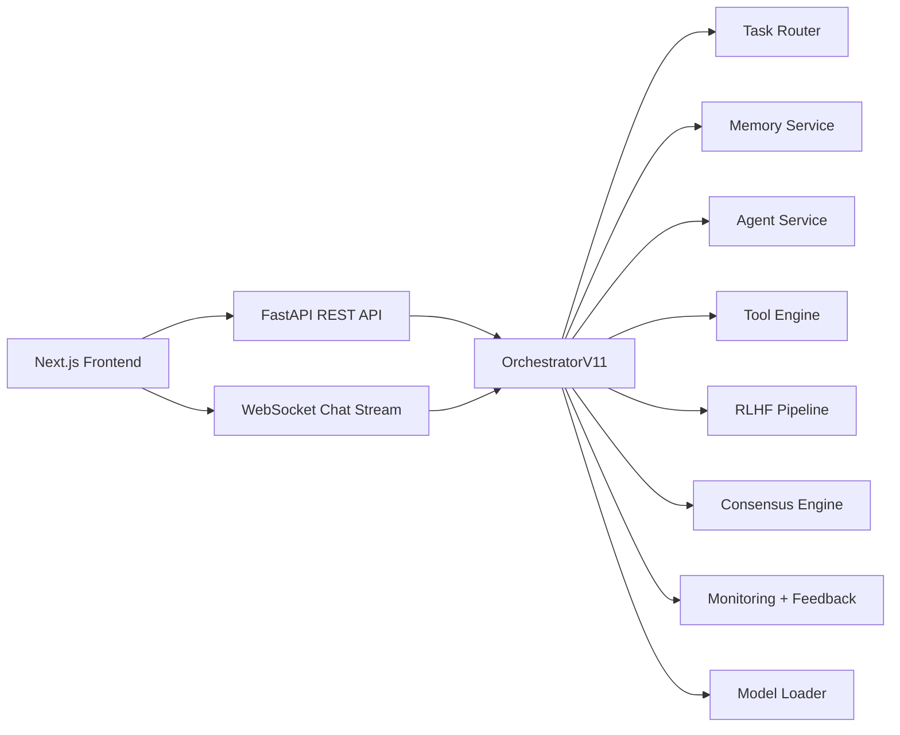

# SuperAI V11

SuperAI V11 is a full-stack AI assistant platform built with FastAPI and Next.js. It combines chat, tool calling, memory, feedback capture, agent orchestration, voice I/O, document processing, retrieval, and optional RLHF / consensus workflows behind a single API and UI.

This repository contains the `superai_v11_final` project as a standalone application package.

## Snapshot

- Backend: FastAPI + WebSocket streaming
- Frontend: Next.js App Router + TypeScript + Zustand
- Core pipeline: routing, memory, monitoring, security, feedback
- V10 features: reflection, learning pipeline, advanced memory, parallel agents, RAG, self-improvement, model registry, AI security, multimodal fusion, task queue, personality adaptation
- V11 features: RLHF pipeline, tool calling engine, multi-model consensus
- Verified in this workspace:
  - `python -m pytest -q` -> `82 passed`
  - `npm run type-check` -> passed
  - `npm run build` -> passed

## Architecture



## Feature Overview

### Core capabilities

- Chat over REST and WebSocket streaming
- Session history and memory retrieval
- Autonomous / assisted agent runs
- Voice transcription and text-to-speech
- Vision analysis endpoint
- File upload and question answering
- Code assistant and code scan endpoints
- Feedback collection and rolling quality stats
- System status, metrics, and process timing headers

### V10 feature layer

- Reflection engine for low-confidence answers
- Learning pipeline fed from stored feedback and conversation data
- Advanced memory with episodic + semantic graph components
- Parallel multi-agent execution
- Retrieval-augmented knowledge lookup
- Self-improvement / failure logging
- Model registry and routing support
- AI security checks
- Multimodal fusion hooks
- Async task queue abstraction
- Personality / emotional adaptation engine

### V11 feature layer

- RLHF endpoints for DPO / GRPO orchestration
- Tool calling engine with built-in tools
- Consensus engine for multi-model voting

## Built-in Tools

The V11 tool engine ships with these built-in tools:

- `web_search`
- `calculator`
- `code_execute`
- `wikipedia`
- `weather`
- `file_read`
- `datetime`

`code_execute` is intentionally sandboxed and blocks dangerous imports / calls.

## Repository Layout

```text
superai_v11_final/
|- backend/
|  |- api/                 REST + WebSocket routes
|  |- app/                 app factory + dependency container
|  |- core/                orchestrator, logging, routing, security
|  |- models/              schema layer + lazy model loader
|  |- memory/              conversation memory + advanced memory
|  |- services/            voice, vision, monitoring, feedback, agents
|  |- intelligence/        reflection, learning, registry, self-improvement
|  |- tools/               tool registry + executor + calling engine
|  |- rlhf/                reward model + RLHF pipeline
|  |- consensus/           multi-model consensus engine
|  `- main.py              backend entry point
|- frontend/
|  |- src/app/             Next.js app router
|  |- src/components/      chat, dashboard, agents, voice UI
|  |- src/lib/             API client, state stores, utilities
|  `- package.json
|- config/
|  `- config.yaml          default application configuration
|- docker/                 container files
|- requirements/           Python dependency sets
|- scripts/                Colab launcher scripts
|- tests/                  unit / integration tests
|- .env.example
|- pyproject.toml
`- requirements-dev.txt
```

## Tech Stack

### Backend

- Python 3.11
- FastAPI
- Uvicorn
- WebSockets
- Pydantic v2
- aiosqlite
- Loguru
- Prometheus client

### Frontend

- Next.js 14
- React 18
- TypeScript
- Zustand
- SWR
- Axios
- Framer Motion

### Optional AI / ML dependencies

Used by specific features when installed:

- Transformers
- Accelerate
- Sentence Transformers
- FAISS
- OpenAI Whisper
- gTTS
- pdfplumber
- python-docx
- openpyxl

## Requirements

### Minimum for backend + tests

- Python 3.11
- Node.js 20+ recommended
- npm

### Recommended extras

- FFmpeg for voice workflows
- Git
- A Hugging Face access token if you want to pull gated/private models
- GPU + PyTorch if you want real local inference performance

## Local Development

### 1. Create Python environment

```powershell
cd B:\SuperAI\superai_v11_complete\superai_v11_final
python -m venv .venv
.venv\Scripts\Activate.ps1
python -m pip install --upgrade pip
python -m pip install -r requirements-dev.txt
```

### 2. Create `.env`

```powershell
Copy-Item .env.example .env
```

Default environment variables:

```env
SECRET_KEY=change-me-to-a-random-64-char-string
MODELS__DEVICE=auto
SERVER__PORT=8000
SERVER__ENVIRONMENT=development
REDIS_URL=redis://localhost:6379/0
HF_TOKEN=
SENTRY_DSN=
NEXT_PUBLIC_API_URL=http://localhost:8000
NEXT_PUBLIC_WS_URL=ws://localhost:8000
LOGGING__LEVEL=INFO
```

### 3. Install frontend packages

```powershell
cd frontend
npm install
cd ..
```

### 4. Run the backend

```powershell
python -m uvicorn backend.main:app --host 0.0.0.0 --port 8000 --reload
```

Alternative:

```powershell
python backend\main.py
```

### 5. Run the frontend

Open a second terminal:

```powershell
cd frontend
npm run dev
```

### 6. Open the app

- Frontend: [http://localhost:3000](http://localhost:3000)
- Backend docs: [http://localhost:8000/docs](http://localhost:8000/docs)
- Health: [http://localhost:8000/health](http://localhost:8000/health)

## Full Feature Install Notes

`requirements-dev.txt` is enough for API development and tests.

If you want actual local model inference, semantic retrieval, Whisper STT, or file/voice-heavy workflows, you will also need a compatible PyTorch build and a subset of the packages listed in `requirements/colab.txt`.

Typical path:

1. Install PyTorch separately for your OS / CUDA version.
2. Then install optional feature packages:

```powershell
python -m pip install -r requirements\colab.txt
```

On Windows, you may prefer installing only the packages you need instead of the entire Colab profile.

## Configuration

Primary config lives in [`config/config.yaml`](config/config.yaml).

Important sections:

- `server`
- `models`
- `memory`
- `voice`
- `security`
- `agent`
- `feedback`
- `logging`
- `reflection`
- `learning`
- `advanced_memory`
- `parallel_agents`
- `rag`
- `self_improvement`
- `model_registry`
- `ai_security`
- `multimodal`
- `distributed`
- `personality`
- `rlhf`
- `tools`
- `consensus`

Environment variables override settings via `pydantic-settings`. Examples:

- `SERVER__PORT=8000`
- `SERVER__ENVIRONMENT=development`
- `MODELS__DEVICE=cuda`
- `LOGGING__LEVEL=INFO`
- `REDIS_URL=redis://localhost:6379/0`
- `HF_TOKEN=...`

## Running Tests And Checks

### Backend tests

```powershell
python -m pytest -q
```

### Frontend type-check

```powershell
cd frontend
npm run type-check
```

### Frontend production build

```powershell
cd frontend
npm run build
```

## API Overview

Base prefix: `/api/v1`

### Main route groups

- `/chat`
- `/agents`
- `/memory`
- `/voice`
- `/vision`
- `/files`
- `/code`
- `/system`
- `/feedback`
- `/intelligence`
- `/knowledge`
- `/learning`
- `/security`
- `/personality`
- `/rlhf`
- `/tools`
- `/consensus`

### Health and docs

- `GET /health`
- `GET /docs`
- `GET /redoc`

### WebSocket

- `ws://localhost:8000/ws/chat`

Message format:

```json
{
  "type": "chat",
  "payload": {
    "prompt": "Explain retrieval augmented generation",
    "session_id": "abc123",
    "temperature": 0.7,
    "max_tokens": 512,
    "force_model": "TinyLlama/TinyLlama-1.1B-Chat-v1.0"
  }
}
```

Server frames:

- `token`
- `done`
- `error`
- `pong`

## Example Requests

### Chat

```powershell
curl -X POST "http://localhost:8000/api/v1/chat/" `
  -H "Content-Type: application/json" `
  -d "{\"prompt\":\"Explain vector databases in simple terms\"}"
```

### System status

```powershell
curl "http://localhost:8000/api/v1/system/status"
```

### Tool list

```powershell
curl "http://localhost:8000/api/v1/tools/list"
```

### Tool call

```powershell
curl -X POST "http://localhost:8000/api/v1/tools/call" `
  -H "Content-Type: application/json" `
  -d "{\"prompt\":\"calculate 25 * 48\",\"autonomy_level\":2,\"max_tools\":2}"
```

### RLHF status

```powershell
curl "http://localhost:8000/api/v1/rlhf/status"
```

### Consensus status

```powershell
curl "http://localhost:8000/api/v1/consensus/status"
```

## Frontend

The frontend is a Next.js dashboard with these primary panels:

- Chat
- Agents
- Voice
- Dashboard

Relevant files:

- [`frontend/src/app/page.tsx`](frontend/src/app/page.tsx)
- [`frontend/src/components/chat/ChatPanel.tsx`](frontend/src/components/chat/ChatPanel.tsx)
- [`frontend/src/components/agents/AgentPanel.tsx`](frontend/src/components/agents/AgentPanel.tsx)
- [`frontend/src/components/voice/VoiceUI.tsx`](frontend/src/components/voice/VoiceUI.tsx)
- [`frontend/src/components/dashboard/Dashboard.tsx`](frontend/src/components/dashboard/Dashboard.tsx)

## Colab Workflow

A Colab-oriented launcher is included at [`scripts/run_colab_v11.py`](scripts/run_colab_v11.py).

It can:

- install Colab dependencies
- patch `config.yaml` for `/content`
- start the backend
- open an ngrok tunnel
- expose API docs / status endpoints

Example:

```bash
python scripts/run_colab_v11.py --token YOUR_NGROK_TOKEN
```

## Docker

The repository includes:

- [`docker/docker-compose.yml`](docker/docker-compose.yml)
- [`docker/Dockerfile.backend`](docker/Dockerfile.backend)
- [`docker/Dockerfile.frontend`](docker/Dockerfile.frontend)

Important note:

- These files still contain some legacy `V9` naming and expect extra deployment assets such as Prometheus / nginx config.
- Treat the Docker stack as a starting point, not as the fully re-verified path.

## Observability

- `GET /api/v1/system/status`
- `GET /api/v1/system/metrics`
- `X-Process-Time-Ms` header on HTTP responses
- Loguru-based structured / text logging
- feedback count and average latency exposed in status responses

## Current Development Notes

- Some comments, file headers, and container names still carry legacy `V9` / `V10` labels from earlier iterations.
- Runtime behavior and feature wiring are V11-oriented.
- Consensus is disabled by default until you configure `consensus.models` with at least two models.
- Voice is disabled by default in `config.yaml`.
- Vision falls back to a simple OpenCV description if no vision model is configured.

## Verified Files To Start Reading

- [`backend/app/factory.py`](backend/app/factory.py)
- [`backend/app/dependencies.py`](backend/app/dependencies.py)
- [`backend/core/orchestrator.py`](backend/core/orchestrator.py)
- [`backend/models/loader.py`](backend/models/loader.py)
- [`backend/api/v1/router.py`](backend/api/v1/router.py)
- [`backend/tools/tool_executor.py`](backend/tools/tool_executor.py)
- [`backend/rlhf/rlhf_pipeline.py`](backend/rlhf/rlhf_pipeline.py)

## License

No license file is included in this snapshot. Add one before publishing for broader reuse if you want explicit open-source terms.
